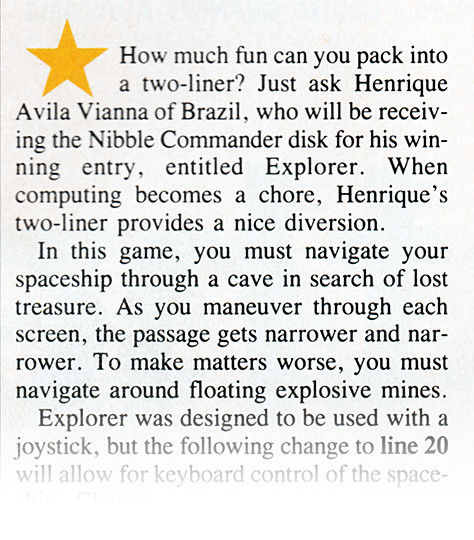
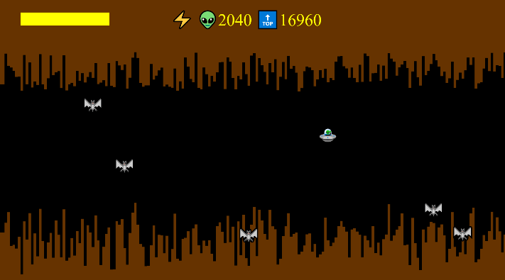
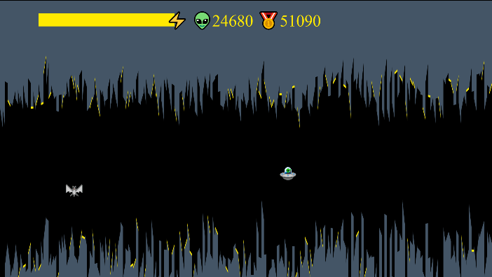

# The making of Xplorer 2019
## Celebrating 30 years of code golfing!

<figure class="align-left">
	
	<figcaption><em>One- and Two-Liners</em> page from the July 1989 issue of Nibble Magazine (click image for full page)</figcaption>
</figure>

I have spent many years of my childhood fiddling with an [Apple II](https://en.wikipedia.org/wiki/Apple_II) computer – playing games,
typing in program listings from magazines, learning from them, and eventually creating my own games.

Back in the 1980s, the term “[code golfing](https://en.wikipedia.org/wiki/Code_golf)” had not yet been coined,
but [Nibble Magazine](https://www.nibblemagazine.com/) was already running a monthly contest entitled “One- and Two-Liners”,
which challenged programming enthusiasts to create a somewhat useful or amusing program, using just one or two lines of
Applesoft BASIC or [6502](https://en.wikipedia.org/wiki/MOS_Technology_6502) machine language.​

To make the most of such limited resources, programmers would resort to all kinds of hacks and clever tricks,
which usually resulted in some really obscure code. For some reason, that made programming look even more interesting to me.

In July of 1989 my two-liner “Explorer” was one of the winning entries! It was a little game that would put you in control
of a spaceship navigating through a cave full of mines, in search of a lost treasure. If you managed to beat the last level,
the ship would just blink for a few seconds and you’d be congratulated with a “You got it!” message.
It even had some rudimentary sound. I was really proud of it!

<figure class="align-right">
	
	<figcaption>The original 1989 “Explorer” running on the Applewin emulator</figcaption>
</figure>

Many years later, in 2012, I came across the [JS1k](https://js1k.com/) competition and it instantly reminded me of the old Nibble
contest, but taken to another level. I was already familiar with JavaScript, but the kind of code behind [those](https://js1k.com/2010-first/demo/750)
[impressive](https://js1k.com/2013-spring/demo/1459) [demos](https://js1k.com/2018-coins/demo/3075) was still way over my head.
It was only several years later that I finally decided to learn some of those techniques.

I began studying a couple of winning JS1k entries (see References at the bottom) and then found [dwitter.net](https://www.dwitter.net/)
and [codegolf.tk](https://codegolf.tk/) – two JS code golfing sites, with plenty of examples to learn from, a friendly community
and a perfect environment to practice.

I eventually came up with a new take on my Explorer game, now with color graphics, an endless scrolling cave with increasing
difficulty, energy system and high score. All of that in 510 characters of JavaScript. Not too shabby, eh? I [published it on
codegolf.tk](https://codegolf.tk/a/296) in 2018.

<figure class="align-right">
	
	<figcaption>The early JavaScript version written in 2018</figcaption>
</figure>

### JS1k 2019

In February 2019 [I hear this may be the last edition of JS1k](https://twitter.com/js1k/status/1092179427671318533).
I rush to the site for more info and see this year’s theme is “X”. Although submissions are not required to comply with the
theme, I reckon “Xplorer” sounds way too fitting not to do it :D Besides, it’s the 10th anniversary of JS1k and the 30th(!)
of my two-liner published on Nibble – it feels like the perfect opportunity to celebrate in great style!

The first thing I needed to improve was the way the ship and the bats were drawn on the canvas. I needed them all as individual
objects, so I could do better animations and collision detection.

The solution was creating an auxiliary canvas, where I keep just the background cave. On every frame, the background is scrolled
right, updated with a new segment of the cave and copied to the main (visible) canvas, where everything else is then drawn. The bats'
coordinates are now stored in an array, and they’re redrawn on every frame, just like the ship.

Next, I used the shadowOffsetY property to add some colored “crystals” to the cave, and a glowing light below the ship while it’s
recharging, so it’s like the ship absorbs energy from the crystals. I also added some random variation to the ship’s Y coordinate,
while it’s flying closer to the ground, to make it look like turbulence.

I could now add some movement to the bats too. I initially added just a random variation to their X and Y coordinates, but then
realized I could reuse the variable which makes the cave narrower (the “difficulty factor”) to also make bats grow more aggressive
over time – at first, they will run away from you, then will gradually begin to come towards you, faster and faster.

Since bats were now more challenging to avoid, I thought of adding a weapon to the ship. I had an idea for a simple “laser beam”
animation: over 5 animation frames I would draw a horizontal line of decreasing height – 5 pixels, then 4, 3, 2 and 1. It was easy
to code and I think it got the job done. I made the laser consume an additional amount of energy, so the game didn’t get too easy.
For the collision detection, I check if a bat is in the vertical range of the laser, and then just move it off-screen by adding the
canvas width to its X coordinate.

Now it was still lacking some sound. By using a simple Web Audio oscillator, I managed to create some minimalistic sound effects
which are all played by a single little chunk of code – the laser sound, a low-pitch background humming for the ship’s engine and
some random blipping while recharging.

And with a few extra bytes, I could save the high score permanently on the browser’s local storage.

<figure class="align-right">
	
	<figcaption>The final version submitted to JS1k 2019</figcaption>
</figure>

The game had already improved a lot, but I was still unhappy with the cave’s blocky appearance. I wanted it to look more organic,
so I tried using more complex polygons to generate the cave walls, until I reached a solution with a reasonable cost/benefit ratio.
I then tried some different colors and found a better hue for the cave, but couldn’t ultimately decide on which color looked the
best for the crystals. So I used a few spare bytes to pick a random color at the start of each run.

At last, after several iterations of adding new features, exceeding the size limit, optimizing and fixing bugs, “Xplorer 2019” was born!

It was eventually [placed 27th](https://js1k.com/votes.html) among the 87 entries submitted to JS1k 2019. It was a thrilling
competition, I learned a lot and had a lot of fun!

The final version uses 1023 bytes. I wanted to keep the code legible straight away, so I decided not to resort to any code compressor.
All optimizations were done manually, using every code golfing technique I have learned in the past six months or so.

I hope you enjoy the game and maybe learn something new as well.

<a href="index.html">▶ Play the game!</a>

[▶ View the entry on JS1k website](https://js1k.com/2019-x/details/4188)

[▶ View the commented source code on GitHub](https://github.com/hvianna/Xplorer2019/blob/master/src/xplorer2019.js)

### References

- [Marijn Haverbeke’s “Bouncing Beholder” write-up](https://marijnhaverbeke.nl/js1k/)
- [yonatan’s “Solar Quartet” commented source code](https://codepen.io/y0natan/pen/MVvxBM?editors=0010)
- [Jed’s Byte-saving Techniques](https://github.com/jed/140bytes/wiki/Byte-saving-techniques) compilation
- Too many awesome entries at [dwitter.net](https://www.dwitter.net/) and [codegolf.tk](https://codegolf.tk/) – I’d probably fail to credit them all